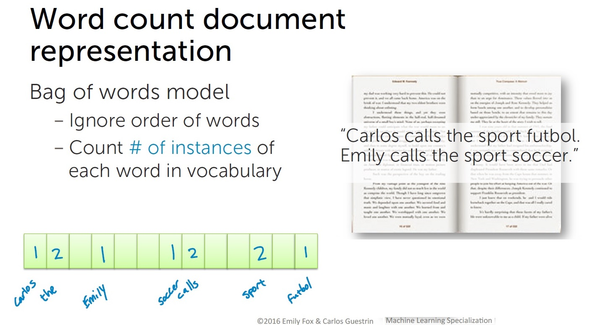
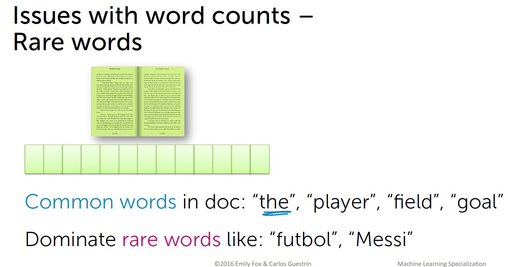
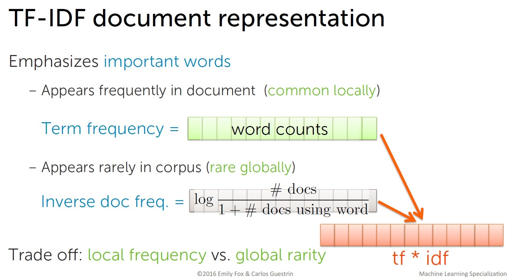

# Unsupervised Learning - Clustering
用scikit-learn執行unsupervised learning的基礎，包含以下程式碼。  
### 1 Unsupervised Learning.ipynb
此範例說明如何將高維度的特徵降維以顯示在圖上，方法包含Principal Components Analysis(PCA)、Multidimensional scaling (MDS)、t-SNE。  
並說明如何用scikit-learn做clustering，方法包含K-means、Agglomerative clustering、DBSCAN clustering。  

### 2 text clustering.ipynb
此範例說明如何對未標簽的文章做分類，首先用TF-IDF(Term Frequency - Inverse Document Frequency)提取特徵，再用K-Means做分群。    

### 3 BBC news clustering.ipynb
此範例和上一例類似，做資料量較大的新聞分群。  

### TF-IDF
代表文章特徵的一種方法。  
  
  
  

## References
https://scikit-learn.org/stable/modules/generated/sklearn.cluster.KMeans.html  
https://www.coursera.org/learn/python-machine-learning?specialization=data-science-python  
https://www.coursera.org/learn/ml-foundations?specialization=data-science-python  
